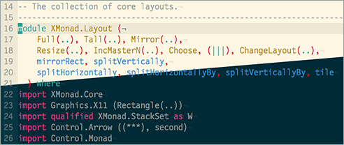

Solarized Dark and Light themes created using the [Theme Converter](https://aka.ms/themeconverter).

This is a repack because the [Visual Studio Theme Pack](https://marketplace.visualstudio.com/items?itemName=idex.vsthemepack) does not have an arm64 target.

